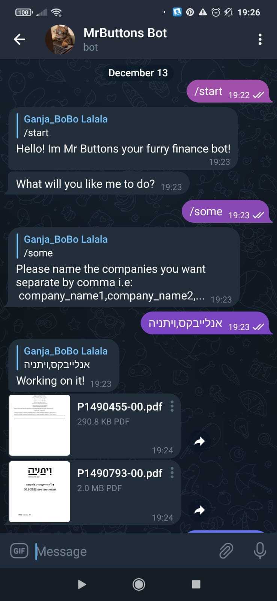
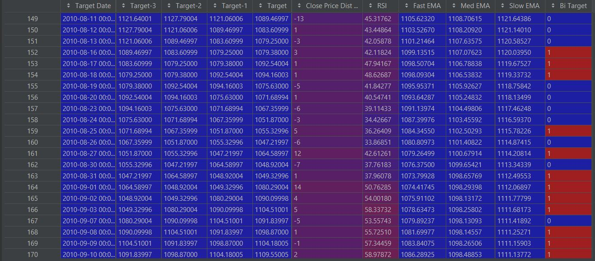
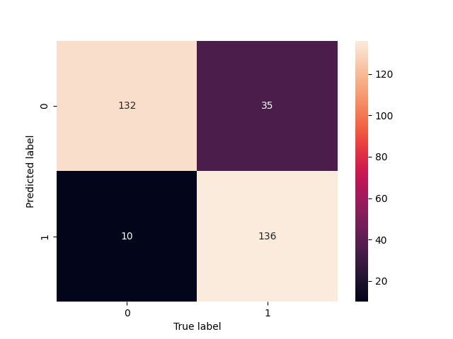

# Python Finance ML and Crawler
Goal: help users without any preliminary finance knowledge to decide 
whether a stock price will increase its price or not using matching
learning models (the stocks can be any stock from the top 500 companies in the world)
as well as receive pdf files of financial reports which can be 
found in "maya.tase.co.il" website.
More over the user can reach out a telegram bot named "MrButtons Bot"
and retrieve all the information above.

# Files
This repository contains 4 main files:
* pdf_download.py - The pdf crawler which retrieve the financial reports
  from "maya.tase.co.il" website.
* finance_analyzer.py - API for ML models (mainly LSTM) which learn the stocks
  history and give a classification if a given stock will increase its
  price or not
* telegram_bot.py - The UI for this project. The bot can be found at telegram
  by searching for "MrButtons Bot". 
* project_db.py - Database for the project which saves the trained model
  as well as the information needed for the bot.

REMARK - This project is sill in development and will have more features
and debugging in the future 

# Some pics 

